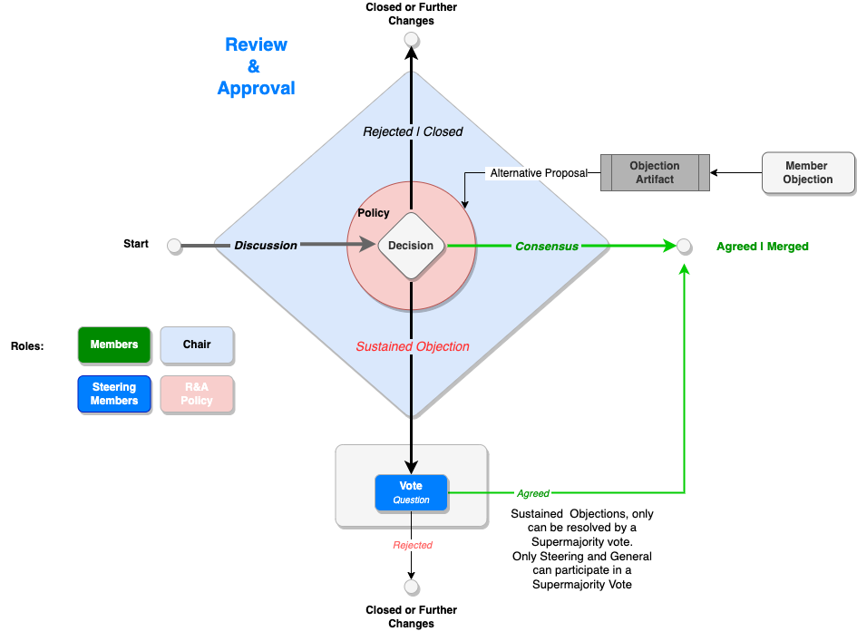

## FOCUS Workflow Procedures

## Specification LifeCycle
The **Specification Lifecycle** outlines the end-to-end process for creating, refining, reviewing, and releasing specifications in the FinOps FOCUS project. This lifecycle ensures that each specification is rigorously developed, approved, and made publicly available for stakeholder implementation.

<figure>
    
    <figcaption>FOCUS Specifications Lifecycle</figcaption>
</figure>

1. **Work Item Creation:** Propose and define the scope and objectives of a new specification.
2. **Specification Development:** Draft and refine technical content to ensure the specification meets its intended goals.
3. **Consistency, IPR Review:** Review the draft for coherence, intellectual property rights compliance, and alignment with the defined scope.
4. **Final Specification Working Group Approval:** Validate the specification against technical and quality standards set by the working group.
5. **Steering Committee Ratification:** Obtain higher-level oversight and approval for public release from the steering committee.
6. **Technical Specification Publication:** Officially publish and release the specification with a version number for stakeholder implementation.

### 1. Work Item Creation Phase
The below diagram illustrates the **Work Item Creation** phase, which is the first stage in the Specifications Lifecycle for the FinOps FOCUS project. The main purpose of this phase is to define and refine the scope for the next FOCUS release, such as e.g. v1.2, ensuring that all proposed work items align with strategic priorities and are well-documented and actionable.

<figure>
    
    <figcaption>FOCUS Work Item Creation Phase</figcaption>
</figure>

#### Key Steps in Scope Definition:

1. **Ideation and Intake:** The process begins by capturing a variety of inputs, including bugs, use cases, discussion documents, pull requests (PRs), and spreadsheets. These inputs serve as the foundation for new Work Item Issues, which are documented using a standardized template to ensure consistency across all submissions.

2. **Work Item Issue Documentation:** For each potential work item, a Work Item Issue is created with mandatory information, such as a title, problem statement, and relevant supporting documents (e.g., data examples, or epics for consideration). This documentation provides the initial structure and context for each proposal, making it easier to assess relevance to the release scope.

3. **Triage and Theming:** The Maintainers and the Steering Committee (SC) review each Work Item Issue to evaluate alignment with high-level FinOps themes and release priorities. This triage step is critical for categorizing and prioritizing items, helping to shape the initial scope for the upcoming release by filtering out items that do not align with current goals.

4. **Elaboration and Input:** Items that pass the triage are moved to the Elaboration phase, where additional supporting documents are prepared, and each item is assigned to relevant epics. Stakeholders provide input to further clarify requirements and validate that each work item aligns with both technical and business objectives, ensuring it is relevant to the intended scope for the release.

5. **Requirements Documentation:** After elaboration, a Requirements Document is created for all the work items. This document details essential information, including the estimated effort level and priority, collaboratively determined by both stakeholders and maintainers. This formalized documentation helps clarify expectations and ensures that all necessary information is captured to support the item’s inclusion in the upcoming release.

6. **Epic Assignment and Steering Committee Ratification:** Completed requirements are grouped into epics and presented to the Steering Committee for review. Through ratification, the committee finalizes which epics and associated work items will be included in the scope for the targeted release version, such as e.g., v1.2.

### 2. Development Phase
The **Specification Development** phase is a structured process in the FinOps FOCUS project, implemented in GitHub, that guides contributions from ideation to final approval. This phase ensures that all contributions—whether new features, modifications, or corrections—are thoroughly reviewed, aligned with project goals, and integrated into the technical baseline when approved. The workflow progresses through the following stages:

<figure>
    
    <figcaption>FOCUS Specification Development Phase</figcaption>
</figure>

1. **Creation:**
    * **WG Members Generate Contributions:** Working Group (WG) members initiate contributions by creating Issues or Pull Requests (PRs) on GitHub. These contributions represent proposed changes, new features, or corrections aligned with the project’s defined scope.
    * **Parking Lot (Qualifiers):** Items that are either not immediately actionable or need further clarification are placed in the **Parking Lot** for future consideration. This stage allows the project to capture ideas and prioritize contributions that require additional refinement before moving forward.

2. **Discussion:**
    * **Triage:** All contributions are reviewed by the **Maintainers** who assess each item’s relevance, urgency, and alignment with project goals. During this **Triage** stage, maintainers determine which items should proceed to development, be redirected for more information, or remain in the **Parking Lot**.
    * **Work in Progress:**
        * Contributions approved in triage move to **Work in Progress**, where they undergo in-depth discussion and development.
         * **Task Forces** (e.g., Task Force 1, 2, or 3) lead the discussion and development of contributions, focusing on technical details, implications, and solutions.
         * **Maintainers** guide these discussions, ensuring that work progresses within project standards and timelines and that contributions align with the project’s broader objectives.

3. **Review & Approval:**

    * **WG Member Review & Approval:** Once contributions reach a mature state, they enter the **Review & Approval** phase. Here, WG members and maintainers thoroughly scrutinize each item for technical accuracy, completeness, and consistency with project standards.
    * **Consensus-Based Decision:** Contributions are reviewed in a structured manner, with members engaging in discussions to address feedback and achieve consensus. If consensus is reached, the contribution moves forward. If further modifications are required, the item may be sent back for additional work or revision.

4. **Conclusion:**

    * **Merged or Closed:** At the end of the development phase, contributions are either:
        * **Merged** into the technical baseline, formally incorporating the changes into the project.
        * **Closed** if they are deemed unnecessary, outdated, or not aligned with current project goals.

#### Review & Approval Process
The diagram in this section outlines the **Review & Approval (R&A)** process, which is activated whenever consensus is required on proposed documents or decisions in the FOCUS project. This process typically takes place during FOCUS Members' Meetings, where members discuss, review, and seek to reach agreement on key items needing formal approval.

The **R&A** process follows a structured path, emphasizing open discussion, consensus-building, and, if necessary, voting to resolve objections. The diagram serves as a guide for this process, detailing each stage and the possible outcomes.

<figure>
    
    <figcaption>Review & Approval Process</figcaption>
</figure>

#### Key Highlights of the R&A Process:

1. **Objections and Artifacts:**
    * Members who wish to object to a proposal are encouraged to submit an Objection Artifact, such as a Pull Request or Issue proposal, to clearly articulate their concerns and offer constructive alternatives.

2. **Decision Path:**
    * **Discussion:** The process begins with a collaborative discussion among members to understand different perspectives and address any concerns. The goal is to achieve consensus without formal voting.
    * **Decision:** Following discussion, a decision is made. If there are no objections, the proposal is marked as **Agreed** and merged or approved.

3. **Handling Objections:**
    * If an objection is raised, members attempt to resolve it through consensus.
    * If consensus cannot be achieved, the objection is sustained, and the proposal moves to a Vote.

> Note: Voting on a proposal is considered a last resort. While voting is possible, the group is strongly encouraged to reach a resolution through discussion and consensus wherever feasible.

4. **Voting Requirements:**
 * **For Technical Votes:**
    * Only **Steering Members** and **General Members** are eligible to participate.
    * A **Supermajority Vote** is required to resolve technical disputes, ensuring that only the most critical disagreements necessitate formal voting and higher levels of consensus.
    * If the vote results in an agreement, the proposal proceeds as **Agreed** and is merged. If rejected, it may require further changes or be closed.

5. **Final Outcomes:**
 * **Agreed / Merged:** If consensus is achieved or a vote passes, the proposal is approved and implemented.
 * **Rejected / Closed:** If consensus cannot be reached and the vote fails, the proposal is closed.

This **R&A** process fosters an inclusive, structured approach to decision-making, ensuring that all member concerns are addressed, and important technical issues are resolved with input from both Steering and General Members. By establishing clear steps for consensus-building and a formal voting mechanism, the R&A process maintains rigor and accountability within the FOCUS project.

### 3. Consistency & IPR Reviews

**Consistency Review:** The Consistency Review phase in the FinOps FOCUS Project Specifications Lifecycle is a critical step that ensures the draft specification maintains coherence, clarity, and uniformity with the project's defined scope and objectives. During this review, which typically lasts two weeks, all members of the working group are encouraged to meticulously scrutinize the document. They are tasked with identifying any discrepancies, ambiguities, or inconsistencies that could undermine the specification's effectiveness or its interoperability with other standards.

Feedback from this review is typically formalized through the creation of new Issues or Pull Requests on the project's management platform (GitHub). This structured feedback mechanism allows for systematic tracking, discussion, and resolution of concerns raised during the review. It's a collaborative process that ensures all potential problems are addressed before the specification advances to the next stage. The aim is to refine the specification to a point where it not only meets but exceeds the expectations for clarity and consistency required for a robust standard.

**IPR Review:** Following the closure of the **Consistency Review**, the IPR (Intellectual Property Rights) Review commences. This review lasts typically 30 days and is a safeguarding measure to protect the legal integrity of the specification. The IPR Review addresses the crucial aspect of ensuring that the content of the specification does not inadvertently infringe upon existing patents held by stakeholders or external entities. This period allows participants to issue Exclusion Notices, which are formal declarations that certain patents they hold are not to be considered part of the open licensing commitments that often accompany standardized technologies.

This proactive measure is important because it allows contributors to protect their proprietary innovations while still participating in the collaborative standard-setting process. By declaring certain technologies or methodologies as out of bounds for the standard’s licensing requirements, companies can maintain control over their intellectual property. This step is essential for preventing future legal disputes over patent infringement and for ensuring that all contributions to the standard are made with clear licensing intentions.

The outcome of the IPR Review should ensure that the specification can be widely adopted without concerns over intellectual property conflicts, thereby supporting a smooth and conflict-free implementation of the standard across various industries and applications. This review not only protects the rights of the contributors but also enhances the standard’s credibility and enforceability in the broader market.

**Interplay Between Consistency and IPR Reviews:** Both the **Consistency** and **IPR Reviews** are interconnected in that they ensure the specification is both technically sound and legally compliant. The rigorous examination during the Consistency Review ensures the specification is clear and unified, which in turn facilitates a more straightforward IPR Review, as clearer specifications are less likely to inadvertently infringe on intellectual property. Together, these reviews form a comprehensive vetting process that enhances the overall quality, legality, and market readiness of the final published standard.

### 4. Working Group Final Approval
**Final Specification Working Group Approval:** The Final Specification Working Group Approval follows the completion of the Consistency and IPR Reviews, the entire specification advances to the **Final Specification Working Group Approval** phase. This stage is essential for affirming that the specification conforms to all predetermined technical and quality standards established by the working group. Unlike earlier stages that might focus on individual proposed revisions (PRs), this phase emphasizes the approval of the complete specification.

During this phase, the working group conducts a comprehensive review of the entire document to ensure that every element of the specification aligns with the group’s expectations and industry standards. The review process is designed to validate the coherence, technical accuracy, and completeness of the specification. It is a critical checkpoint that guarantees the specification not only meets but ideally exceeds the necessary quality benchmarks.

Approval at this stage signifies a collective endorsement by the working group that the specification is ready for broader scrutiny and eventual implementation. This approval is crucial as it transitions the specification from a developmental phase into a potential industry standard, setting the stage for the subsequent Steering Committee Ratification.

### 5. Steering Committee Ratification
**Steering Committee Ratification:** Following the working group’s approval, the specification progresses to the **
** phase. This phase involves higher-level oversight where the Steering Committee reviews the specification to ensure it meets the overarching objectives and quality criteria for public release. The committee's ratification process is designed to be a final checkpoint that verifies the specification's adherence to the intended goals and its compliance with intellectual property rights (IPR). This stage is particularly important for ensuring that the specification has incorporated all necessary feedback and adjustments without compromising its foundational objectives. It serves as a safeguard against potential conflicts or overlooked issues that could undermine the specification’s effectiveness and acceptance.

### 6. Publication
**Technical Specification Publication:** Once ratified by the steering committee, the specification reaches the **Technical Specification Publication** phase. This final stage marks the official release of the specification, complete with a version number, making it available for implementation by stakeholders. The publication signifies that the specification has undergone comprehensive development, review, and approval processes and is deemed ready for widespread adoption. The release of the specification is a critical moment, as it transitions from a developmental document into a standard that will guide practical implementations and influence future developments within the field.