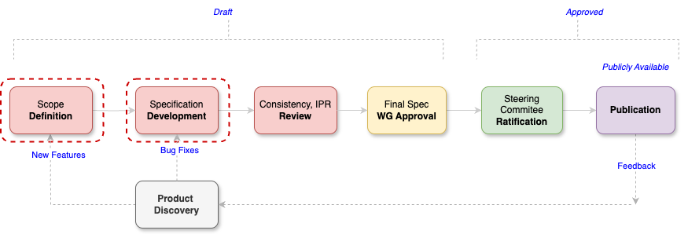
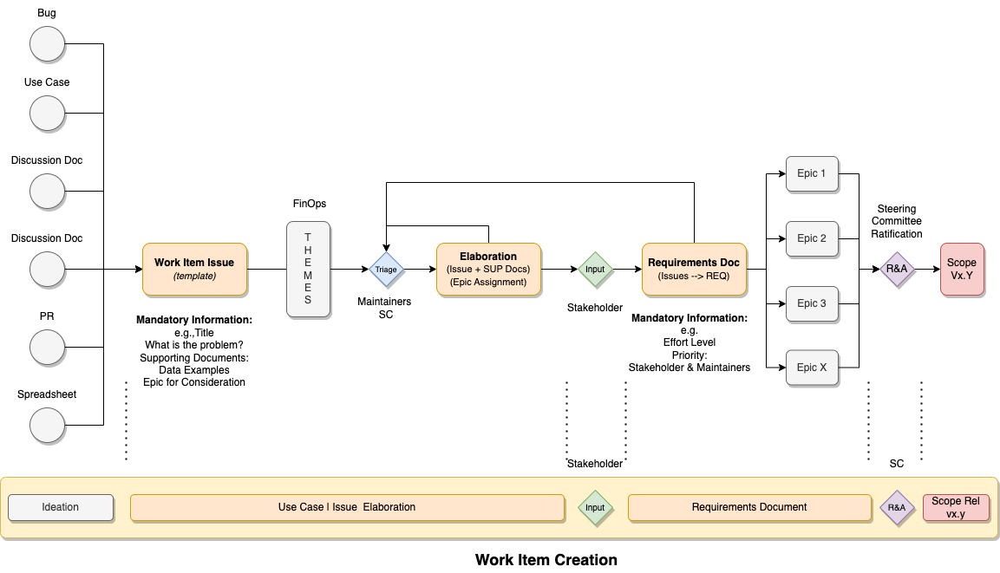
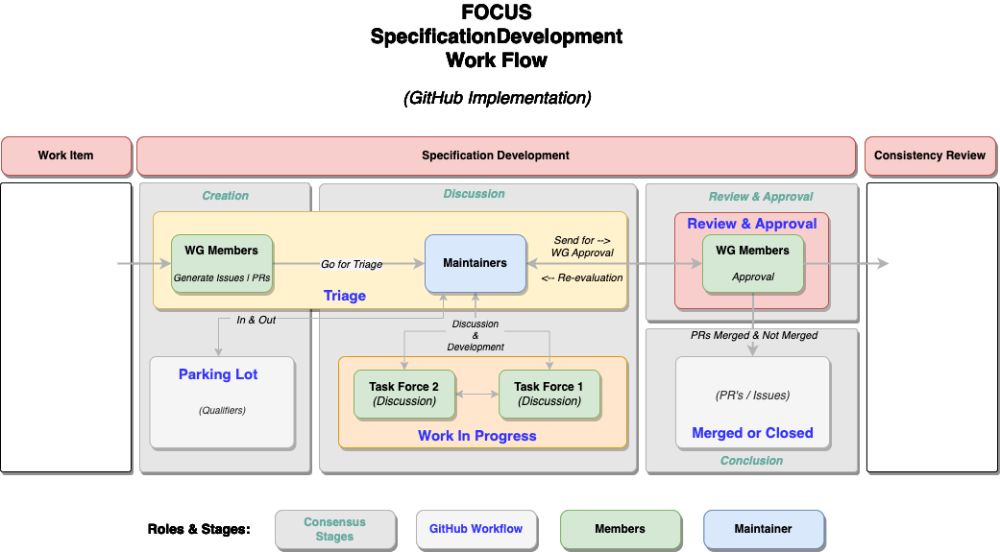

## FOCUS Workflow Procedures

## Specification LifeCycle

<figure>
    
    <figcaption>FOCUS Specifications Lifecycle</figcaption>
</figure>

### Work Item Creation Phase

<figure>
    
    <figcaption>FOCUS Work Item Creation Phase</figcaption>
</figure>

### Development Phase

<figure>
    
    <figcaption>FOCUS Specification Development Phase</figcaption>
</figure>

### Consistency & IPR Reviews

### Working Group Final Approval

### Steering Committee Ratification

### Publication